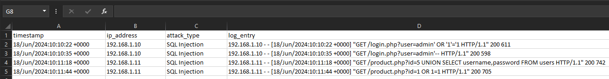
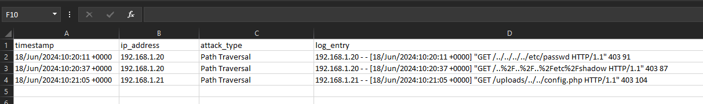
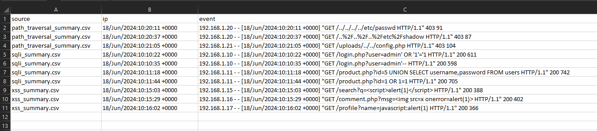

# Web Attack Log Detector  
Log-Based Attack Detection & Incident Simulation (SOC Project)

## 📌 Overview

This project simulates how a SOC analyst investigates suspicious web activity using server access logs.

It analyzes Apache/Nginx-style logs to detect common web attack patterns such as:

- SQL Injection (SQLi)
- Cross-Site Scripting (XSS)
- Path Traversal

The focus is detection, evidence extraction, and structured incident reporting — not exploitation.

---

## 🧪 Simulated Attack Scenario

A web server begins receiving abnormal HTTP requests containing encoded payloads, traversal attempts, and injection patterns.

The tool processes raw logs to identify suspicious requests, extract forensic indicators, and generate an investigation-ready incident report.

---

## 🔎 Investigation Workflow

1. Raw access logs ingested  
2. Detection modules executed independently  
3. Malicious patterns identified  
4. Evidence extracted:
   - timestamp
   - IP address
   - attack type
   - full request string  
5. CSV evidence generated  
6. Incident report compiled  
7. Timeline correlation created  

---

## 📊 Extracted Evidence

### SQL Injection Attempts


### Path Traversal Activity


### Cross-Site Scripting Attempts


### Timeline Correlation of Attacks


---

## 📁 Project Structure

```
web-attack-log-detector/
│
├── core/
│ └── main.py
│
├── evidence_data/
│ ├── sqli_summary.csv
│ ├── xss_summary.csv
│ └── path_traversal_summary.csv
│
├── logs/
│ └── sample_access.log
│
├── modules/
│ ├── sqli_detector.py
│ ├── xss_detector.py
│ └── path_traversal_detector.py
│
├── reports/
│ └── attack_report.txt
│
├── screenshots/
│   ├── path_traversal_evidence.png
│   ├── sqli_evidence.png
│   ├── timeline_correlation.png
│   ├── xss_evidence.png
|
├── utils/
│ ├── evidance_csv.py
│ ├── report_generator.py
│ └── timeline_generator.py
│
└── README.md
```

## 🧠 Detection Logic

Pattern-based detection modules scan raw requests to identify known malicious behavior.

Each detection preserves structured forensic evidence for investigation and correlation.

---

## 🗂️ MITRE ATT&CK Mapping

- SQL Injection → T1190 (Exploit Public-Facing Application)  
- Path Traversal → T1006 (Path Traversal)  
- XSS → T1059 (Command & Script Injection context)

---

## 🔎 Analyst Notes

- Multiple attack vectors observed from recurring IP sources  
- SQLi + Path traversal attempts suggest reconnaissance followed by exploitation attempts  
- Timeline correlation highlights coordinated activity  

---

## ▶️ How to Run

```bash
python -m core.main
```

---

## 📁 Output

- CSV evidence files
- incident report
- timeline correlation

Stored in:
- `evidence_data/`
- `reports/`

---

## 🎯 Objective

Demonstrate log-based detection, evidence preservation, and SOC-style incident investigation workflow.